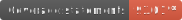
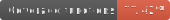
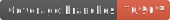

# FolEs

<p align="center">
  

  <p align="center">
    Linguagem de Folhas de Estilo em Português, para geração de CSS.
  </p>

  <p align="center">
    
    
    
    
    <a href="https://github.com/DesignLiquido/FolEs/issues" target="_blank">
      
    </a>
    
    
    <a href="https://www.npmjs.com/package/@designliquido/foles" target="_blank">
      
    </a>
    
  </p>

  <p align="center">
    Acompanhe a Design Líquido nas redes sociais:
  </p>

  <p align="center">
    <a href="https://twitter.com/designliquido" target="_blank"></a>
    <a href="https://www.instagram.com/design.liquido" target="_blank"></a>
    <a href="https://www.youtube.com/channel/UCJRn3B7r0aex6LCaOyrQtZQ" target="_blank"></a>
    <a href="https://www.linkedin.com/company/design-liquido" target="_blank"></a>
    <a href="https://www.tiktok.com/@designliquido" target="_blank"></a>
  </p>
</p>

## Motivação

Assim como linguagens de programação e de marcação, linguagens de estilo como CSS podem ser difíceis de aprender em português.

FolEs começa do mesmo ponto que [SASS](https://sass-lang.com/), como uma linguagem de extensão que gera CSS. A base de CSS é HTML. A base de FolEs é [LMHT](https://github.com/DesignLiquido/LMHT).

Adicionalmente, FolEs possui um recurso de tradução reversa. Em outras palavras, FolEs pode ingerir um arquivo CSS e devolver seu correspondente em FolEs.

## Exemplos

Se queremos definir estilos para um documento inteiro, podemos usar:

```
lmht {
    tamanho-fonte: 12px;
}
```

Isso traduz para o seguinte CSS:

```css
html {
    font-size: 12px;
}
```

## Instalação

Para instalar FolEs globalmente, use o seguinte comando:

```sh
npm i -g @designliquido/foles
```

## Execução

Após instalar globalmente pelo npm, para executar FolEs traduzindo um arquivo chamado `exemplo.foles`, use:

```sh
foles exemplo.foles
```

Para tradução reversa:

```sh
foles exemplo.css
```

### VSCode

No Visual Studio Code, adicione no seu `launch.json` o seguinte:

```jsonc
    "configurations": [
        {
            "type": "node",
            "request": "launch",
            "name": "FolEs",
            "skipFiles": ["<node_internals>/**", "node_modules/**"],
            "cwd": "${workspaceRoot}",
            "console": "integratedTerminal",
            "args": [
                "${workspaceFolder}${pathSeparator}execucao.ts",
                "${workspaceFolder}${pathSeparator}exemplos${pathSeparator}exemplo.foles"
            ],
            "runtimeExecutable": "node",
            "runtimeArgs": ["--nolazy", "-r", "ts-node/register/transpile-only"]
        },
    ]
```

## Arquitetura

FolEs copia vários elementos de [Delégua](https://github.com/DesignLiquido/delegua), como um Lexador e um Avaliador Sintático, mas contém um elemento original (um Tradutor, que usa o retorno do Avaliador Sintático para gerar uma folha de estilo em CSS). 

### Seletores

Um seletor é uma expressão que encontra N elementos em um documento LMHT que possuem certas características, como por exemplo o nome de uma estrutura, um id, uma classe e atributos dessa estrutura. Por exemplo:

```foles
ligacao {

}
```

Encontra todas as estruturas de um documento LMHT cujo nome da estrutura seja ligação:

```xml
<lmht>
    <cabeça>
    </cabeça>
    <corpo>
        <ligacao destino="https://github.com/DesignLiquido">GitHub da Design Líquido</ligacao>
        <ligacao destino="https://github.com/DesignLiquido/delegua">Linguagem Delégua</ligacao>
        <ligacao destino="https://github.com/DesignLiquido/FolEs">Linguagem FolEs</ligacao>
    </corpo>
</lmht>
```

Neste exemplo, portanto, irá encontrar três estruturas.

Podemos ainda selecionar por um identificador único:

```foles
#ligacao1 {

}
```

Para o exemplo modificado:

```xml
<lmht>
    <cabeça>
    </cabeça>
    <corpo>
        <ligacao id="ligacao1" destino="https://github.com/DesignLiquido">GitHub da Design Líquido</ligacao>
        <ligacao id="ligacao2" destino="https://github.com/DesignLiquido/delegua">Linguagem Delégua</ligacao>
        <ligacao id="ligacao3" destino="https://github.com/DesignLiquido/FolEs">Linguagem FolEs</ligacao>
    </corpo>
</lmht>
```

Iremos encontrar uma estrutura. Ainda, podemos usar algo assim:

```foles
.minhaligacao {

}
```

E modificar o exemplo mais uma vez:

```xml
<lmht>
    <cabeça>
    </cabeça>
    <corpo>
        <ligacao classe="minhaligacao" destino="https://github.com/DesignLiquido">GitHub da Design Líquido</ligacao>
        <ligacao classe="outraligacao" destino="https://github.com/DesignLiquido/delegua">Linguagem Delégua</ligacao>
        <ligacao classe="minhaligacao" destino="https://github.com/DesignLiquido/FolEs">Linguagem FolEs</ligacao>
    </corpo>
</lmht>
```

E encontraremos apenas duas das três estruturas.

### Modificadores

Um modificador é toda e qualquer propriedade declarada no escopo de um seletor que irá causar uma modificação em estruturas de um documento. Voltando ao exemplo da seção anterior:

```foles
ligacao {
    tamanho-fonte: 16px;
}
```

Se aplicamos este estilo ao documento do primeiro exemplo, todas as três estruturas receberão uma modificação de estilo, ou seja o tamanho da fonte (texto) passa a ter o tamanho de 16 pixels.

### Atributos de Modificadores: Valores, Quantificadores e Qualitativos

FolEs trabalha com três conceitos de atributos em todas as etapas dos ciclos de ingestão de arquivos:

- **Valores**: são os atributos que acompanham modificadores. No exemplo `tamanho-fonte: 16px;`, `tamanho-fonte` é o modificador, e `16px` é o valor. Valores podem ser formados por números absolutos, números acompanhados de quantificadores, quantitativos ou ainda uma combinação de todos esses;
- **Quantificadores**: são complementos de valores. No exemplo anterior, `px` é o quantificador, e acompanha o número `16`, a parte numérica do valor;
- **Qualitativos**: são valores adjetivos. Nem todo valor é expresso por um número e uma unidade de medida. Explorando um outro exemplo:

```foles
ligacao {
    estilo-contorno: pontilhado;
}
```

`estilo-contorno` é um modificador que pede um qualitativo. `pontihado` é um qualitativo.

## Mapeamentos


| FolEs                                                                                            | CSS       |
| ------------------------------------------------------------------------------------------------ | ----------|
| [agrupar-palavra](https://github.com/DesignLiquido/FolEs/wiki/Modificador-agrupar-palavra)                         | [word-break](https://developer.mozilla.org/pt-BR/docs/Web/CSS/word-break) |
| [agrupar-vazamento](https://github.com/DesignLiquido/FolEs/wiki/Modificador-agrupar-vazamento)                       | overflow-wrap |
| [ajustar-objeto](https://github.com/DesignLiquido/FolEs/wiki/Modificador-ajustar-objeto)                          | object-fit |
| [ajustar-tamanho-fonte](https://github.com/DesignLiquido/FolEs/wiki/Modificador-ajustar-tamanho-fonte)                   | font-size-adjust |
| [ajuste-cor-forcado](https://github.com/DesignLiquido/FolEs/wiki/Modificador-ajuste-cor-for%C3%A7ado)                      | forced-color-adjust |
| [ajuste-cor-forçado](https://github.com/DesignLiquido/FolEs/wiki/Modificador-ajuste-cor-for%C3%A7ado)                      | forced-color-adjust |
| [alinhar-conteudo](https://github.com/DesignLiquido/FolEs/wiki/Modificador-alinhar-conte%C3%BAdo)                        | align-content |
| [alinhar-conteúdo](https://github.com/DesignLiquido/FolEs/wiki/Modificador-alinhar-conte%C3%BAdo)                        | align-content |
| [alinhar-encaixe-rolagem-mouse](https://github.com/DesignLiquido/FolEs/wiki/Modificador-alinhar-encaixe-rolagem-mouse)           | scroll-snap-align |
| [alinhar-itens](https://github.com/DesignLiquido/FolEs/wiki/Modificador-alinhar-itens)                           | align-items |
| [alinhar-se](https://github.com/DesignLiquido/FolEs/wiki/Modificador-alinhar-se)                              | align-self |
| [alinhar-texto](https://github.com/DesignLiquido/FolEs/wiki/Modificador-alinhar-texto)                           | text-align |
| [alinhar-vertical](https://github.com/DesignLiquido/FolEs/wiki/Modificador-alinhar-vertical)                        | vertical-align |
| [alinhar-ultimo-item](https://github.com/DesignLiquido/FolEs/wiki/Modificador-alinhar-%C3%BAltimo-item)                     | text-align-last |
| [alinhar-último-item](https://github.com/DesignLiquido/FolEs/wiki/Modificador-alinhar-%C3%BAltimo-item)                     | text-align-last |
| [altura](https://github.com/DesignLiquido/FolEs/wiki/Modificador-altura)                                  | height |
| [altura-linha](https://github.com/DesignLiquido/FolEs/wiki/Modificador-altura-linha)                            | line-height |
| [altura-maxima](https://github.com/DesignLiquido/FolEs/wiki/Modificador-altura-m%C3%A1xima)                           | max-height |
| [altura-máxima](https://github.com/DesignLiquido/FolEs/wiki/Modificador-altura-m%C3%A1xima)                           | max-height |
| [altura-minima](https://github.com/DesignLiquido/FolEs/wiki/Modificador-altura-m%C3%ADnima)                           | min-height |
| [altura-mínima](https://github.com/DesignLiquido/FolEs/wiki/Modificador-altura-m%C3%ADnima)                           | min-height |
| [animacao](https://github.com/DesignLiquido/FolEs/wiki/Modificador-anima%C3%A7%C3%A3o)                                | animation |
| [animação](https://github.com/DesignLiquido/FolEs/wiki/Modificador-anima%C3%A7%C3%A3o)                                | animation |
| [ao-mudar](https://github.com/DesignLiquido/FolEs/wiki/Modificador-ao-mudar)                                | will-change |
| [aparencia](https://github.com/DesignLiquido/FolEs/wiki/Modificador-apar%C3%AAncia)                               | appearance |
| [aparência](https://github.com/DesignLiquido/FolEs/wiki/Modificador-apar%C3%AAncia)                               | appearance |
| [area-mascara](https://github.com/DesignLiquido/FolEs/wiki/Modificador-area-mascara)                            | mask-clip |
| [área-máscara](https://github.com/DesignLiquido/FolEs/wiki/Modificador-area-mascara)                            | mask-clip |
| [atraso-animacao](https://github.com/DesignLiquido/FolEs/wiki/Modificador-atraso-anima%C3%A7%C3%A3o)                         | animation-delay |
| [atraso-animação](https://github.com/DesignLiquido/FolEs/wiki/Modificador-atraso-anima%C3%A7%C3%A3o)                         | animation-delay |
| [atraso-transicao](https://github.com/DesignLiquido/FolEs/wiki/Modificador-atraso-transi%C3%A7%C3%A3o)                        | transition-delay |
| [atraso-transição](https://github.com/DesignLiquido/FolEs/wiki/Modificador-atraso-transi%C3%A7%C3%A3o)                        | transition-delay |
| [borda](https://github.com/DesignLiquido/FolEs/wiki/Modificador-borda)                                   | border |
| [borda-direita](https://github.com/DesignLiquido/FolEs/wiki/Modificador-borda-direita)                           | border-right |
| [borda-em-bloco](https://github.com/DesignLiquido/FolEs/wiki/Modificador-borda-em-bloco)                          | border-block |
| [borda-em-linha](https://github.com/DesignLiquido/FolEs/wiki/Modificador-borda-em-linha)                          | border-inline |
| [borda-esquerda](https://github.com/DesignLiquido/FolEs/wiki/Modificador-borda-esquerda)                          | border-left |
| [borda-inferior](https://github.com/DesignLiquido/FolEs/wiki/Modificador-borda-inferior)                          | border-bottom |
| [borda-mascara](https://github.com/DesignLiquido/FolEs/wiki/Modificador-borda-m%C3%A1scara)                           | mask-border |
| [borda-máscara](https://github.com/DesignLiquido/FolEs/wiki/Modificador-borda-m%C3%A1scara)                           | mask-border |
| [borda-superior](https://github.com/DesignLiquido/FolEs/wiki/Modificador-borda-superior)                          | border-top |
| [calha-barra-rolagem](https://github.com/DesignLiquido/FolEs/wiki/Modificador-calha-barra-rolagem)                     | scrollbar-gutter |
| [celulas-vazias](https://github.com/DesignLiquido/FolEs/wiki/Modificador-c%C3%A9lulas-vazias)                          | empty-cells |
| [células-vazias](https://github.com/DesignLiquido/FolEs/wiki/Modificador-c%C3%A9lulas-vazias)                          | empty-cells |
| [citacoes](https://github.com/DesignLiquido/FolEs/wiki/Modificador-cita%C3%A7%C3%B5es)                                | quotes |
| [citações](https://github.com/DesignLiquido/FolEs/wiki/Modificador-cita%C3%A7%C3%B5es)                                | quotes |
| [coluna-em-grade](https://github.com/DesignLiquido/FolEs/wiki/Modificador-coluna-em-grade)                         | grid-column |
| [colunas](https://github.com/DesignLiquido/FolEs/wiki/Modificador-colunas)                                 | columns |
| [combinar-texto-vertical](https://github.com/DesignLiquido/FolEs/wiki/Modificador-combinar-texto-vertical)                 | text-combine-upright |
| [comportamento-em-bloco-rolagem-mouse](https://github.com/DesignLiquido/FolEs/wiki/Modificador-comportamento-em-bloco-rolagem-mouse)    | overscroll-behavior-block |
| [comportamento-em-linha-rolagem-mouse](https://github.com/DesignLiquido/FolEs/wiki/Modificador-comportamento-em-linha-rolagem-mouse)    | overscroll-behavior-inline |
| [comportamento-horizontal-rolagem-mouse](https://github.com/DesignLiquido/FolEs/wiki/Modificador-comportamento-horizontal-rolagem-mouse)  | overscroll-behavior-x |
| [comportamento-rolagem](https://github.com/DesignLiquido/FolEs/wiki/Modificador-comportamento-rolagem)                   | scroll-behavior |
| [comportamento-rolagem-mouse](https://github.com/DesignLiquido/FolEs/wiki/Modificador-comportamento-rolagem-mouse)             | overscroll-behavior |
| [comportamento-vertical-rolagem-mouse](https://github.com/DesignLiquido/FolEs/wiki/Modificador-comportamento-vertical-rolagem-mouse)    | overscroll-behavior-y |
| [composicao-mascara](https://github.com/DesignLiquido/FolEs/wiki/Modificador-composi%C3%A7%C3%A3o-m%C3%A1scara)                      | mask-composite |
| [composição-máscara](https://github.com/DesignLiquido/FolEs/wiki/Modificador-composi%C3%A7%C3%A3o-m%C3%A1scara)                      | mask-composite |
| [configuracoes-variacao-fonte](https://github.com/DesignLiquido/FolEs/wiki/Modificador-configura%C3%A7%C3%B5es%E2%80%90varia%C3%A7%C3%A3o%E2%80%90fonte)            | font-variation-settings |
| [configurações-variação-fonte](https://github.com/DesignLiquido/FolEs/wiki/Modificador-configura%C3%A7%C3%B5es%E2%80%90varia%C3%A7%C3%A3o%E2%80%90fonte)            | font-variation-settings |
| [contar-coluna](https://github.com/DesignLiquido/FolEs/wiki/Modificador-contar-coluna)                           | column-count |
| [contem](https://github.com/DesignLiquido/FolEs/wiki/Modificador-cont%C3%A9m)                                  | contain |
| [contém](https://github.com/DesignLiquido/FolEs/wiki/Modificador-cont%C3%A9m)                                  | contain |
| [conteudo](https://github.com/DesignLiquido/FolEs/wiki/Modificador-conte%C3%BAdo)                                | content |
| [conteúdo](https://github.com/DesignLiquido/FolEs/wiki/Modificador-conte%C3%BAdo)                                | content |
| [contorno](https://github.com/DesignLiquido/FolEs/wiki/Modificador-contorno)                                | outline |
| [coordenadas](https://github.com/DesignLiquido/FolEs/wiki/Modificador-coordenadas)                             | translate |
| [cor](https://github.com/DesignLiquido/FolEs/wiki/Modificador-cor)                                     | color |
| [cor-barra-rolagem](https://github.com/DesignLiquido/FolEs/wiki/Modificador-cor-barra-rolagem)                       | scrollbar-color |
| [cor-borda](https://github.com/DesignLiquido/FolEs/wiki/Modificador-cor-borda)                               | border-color |
| [cor-borda-direita](https://github.com/DesignLiquido/FolEs/wiki/Modificador-cor-borda-direita)                       | border-right-color |
| [cor-borda-em-bloco](https://github.com/DesignLiquido/FolEs/wiki/Modificador-cor-borda-em-bloco)                      | border-block-color |
| [cor-borda-em-linha](https://github.com/DesignLiquido/FolEs/wiki/Modificador-cor-borda-em-linha)                      | border-inline-color |
| [cor-borda-esquerda](https://github.com/DesignLiquido/FolEs/wiki/Modificador-cor-borda-esquerda)                      | border-left-color |
| [cor-borda-inferior](https://github.com/DesignLiquido/FolEs/wiki/Modificador-cor-borda-inferior)                      | border-bottom-color |
| [cor-borda-superior](https://github.com/DesignLiquido/FolEs/wiki/Modificador-cor-borda-superior)                      | border-top-color |
| [cor-contorno](https://github.com/DesignLiquido/FolEs/wiki/Modificador-cor-contorno)                            | outline-color |
| [cor-cursor](https://github.com/DesignLiquido/FolEs/wiki/Modificador-cor-cursor)                              | caret-color |
| [cor-destaque](https://github.com/DesignLiquido/FolEs/wiki/Modificador-cor-destaque)                            | accent-color |
| [cor-enfase-texto](https://github.com/DesignLiquido/FolEs/wiki/Modificador-cor-%C3%AAnfase-texto)                        | text-emphasis-color |
| [cor-ênfase-texto](https://github.com/DesignLiquido/FolEs/wiki/Modificador-cor-%C3%AAnfase-texto)                        | text-emphasis-color |
| [cor-fim-borda-em-bloco](https://github.com/DesignLiquido/FolEs/wiki/Modificador-cor-fim-borda-em-bloco)                  | border-block-end-color |
| [cor-fim-borda-em-linha](https://github.com/DesignLiquido/FolEs/wiki/Modificador-cor-fim-borda-em-linha)                  | border-inline-end-color |
| [cor-fundo](https://github.com/DesignLiquido/FolEs/wiki/Modificador-cor-fundo)                               | background-color |
| [cor-inicio-borda-em-bloco](https://github.com/DesignLiquido/FolEs/wiki/Modificador-cor-in%C3%ADcio-borda-em-bloco)               | border-block-start-color |
| [cor-início-borda-em-bloco](https://github.com/DesignLiquido/FolEs/wiki/Modificador-cor-in%C3%ADcio-borda-em-bloco)               | border-block-start-color |
| [cor-inicio-borda-em-linha](https://github.com/DesignLiquido/FolEs/wiki/Modificador-cor-in%C3%ADcio-borda-em-linha)               | border-inline-start-color |
| [cor-início-borda-em-linha](https://github.com/DesignLiquido/FolEs/wiki/Modificador-cor-in%C3%ADcio-borda-em-linha)               | border-inline-start-color |
| [cursor](https://github.com/DesignLiquido/FolEs/wiki/Modificador-cursor)                                  | cursor |
| [decoracao-cor-texto](https://github.com/DesignLiquido/FolEs/wiki/Modificador-decora%C3%A7%C3%A3o-cor-texto)                     | text-decoration-color |
| [decoração-cor-texto](https://github.com/DesignLiquido/FolEs/wiki/Modificador-decora%C3%A7%C3%A3o-cor-texto)                     | text-decoration-color |
| [decoracao-espessura-texto](https://github.com/DesignLiquido/FolEs/wiki/Modificador-decora%C3%A7%C3%A3o-espessura-texto)               | text-decoration-thickness |
| [decoração-espessura-texto](https://github.com/DesignLiquido/FolEs/wiki/Modificador-decora%C3%A7%C3%A3o-espessura-texto)               | text-decoration-thickness |
| [decoracao-estilo-texto](https://github.com/DesignLiquido/FolEs/wiki/Modificador-decora%C3%A7%C3%A3o-estilo-texto)                  | text-decoration-style |
| [decoração-estilo-texto](https://github.com/DesignLiquido/FolEs/wiki/Modificador-decora%C3%A7%C3%A3o-estilo-texto)                  | text-decoration-style |
| [decoracao-linha-texto](https://github.com/DesignLiquido/FolEs/wiki/Modificador-decora%C3%A7%C3%A3o-linha-texto)                   | text-decoration-line |
| [decoração-linha-texto](https://github.com/DesignLiquido/FolEs/wiki/Modificador-decora%C3%A7%C3%A3o-linha-texto)                   | text-decoration-line |
| [decoracao-texto](https://github.com/DesignLiquido/FolEs/wiki/Modificador-decora%C3%A7%C3%A3o-texto)                         | text-decoration |
| [decoração-texto](https://github.com/DesignLiquido/FolEs/wiki/Modificador-decora%C3%A7%C3%A3o-texto)                        | text-decoration |
| [decoracao-texto-sublinhado](https://github.com/DesignLiquido/FolEs/wiki/Modificador-decora%C3%A7%C3%A3o-texto-sublinhado)              | text-decoration-skip-ink |
| [decoração-texto-sublinhado](https://github.com/DesignLiquido/FolEs/wiki/Modificador-decora%C3%A7%C3%A3o-texto-sublinhado)              | text-decoration-skip-ink |
| [definir-contador](https://github.com/DesignLiquido/FolEs/wiki/Modificador-definir-contador)                        | counter-set |
| [design-tabela](https://github.com/DesignLiquido/FolEs/wiki/Modificador-design-tabela)                           | table-layout |
| [deslocamento](https://github.com/DesignLiquido/FolEs/wiki/Modificador-deslocamento)                            | offset |
| [deslocamento-em-ancora](https://github.com/DesignLiquido/FolEs/wiki/Modificador-deslocamento-em-%C3%A2ncora)                  | offset-anchor |
| [deslocamento-em-âncora](https://github.com/DesignLiquido/FolEs/wiki/Modificador-deslocamento-em-%C3%A2ncora)                  | offset-anchor |
| [deslocamento-texto-sublinhado](https://github.com/DesignLiquido/FolEs/wiki/Modificador-deslocamento-texto-sublinhado)           | text-underline-offset |
| [deslocar-contorno](https://github.com/DesignLiquido/FolEs/wiki/Modificador-deslocar-contorno)                       | outline-offset |
| [deslocar-pontuacao](https://github.com/DesignLiquido/FolEs/wiki/Modificador-deslocar-pontua%C3%A7%C3%A3o)                      |	hanging-punctuation |
| [deslocar-pontuação](https://github.com/DesignLiquido/FolEs/wiki/Modificador-deslocar-pontua%C3%A7%C3%A3o)                      |	hanging-punctuation |
| [direcao](https://github.com/DesignLiquido/FolEs/wiki/Modificador-dire%C3%A7%C3%A3o)                                 | direction |
| [direção](https://github.com/DesignLiquido/FolEs/wiki/Modificador-dire%C3%A7%C3%A3o)                                 | direction |
| [direcao-animacao](https://github.com/DesignLiquido/FolEs/wiki/Modificador-dire%C3%A7%C3%A3o-anima%C3%A7%C3%A3o)                        | animation-direction |
| [direção-animação](https://github.com/DesignLiquido/FolEs/wiki/Modificador-dire%C3%A7%C3%A3o-anima%C3%A7%C3%A3o)                        | animation-direction |
| [distancia-deslocamento](https://github.com/DesignLiquido/FolEs/wiki/Modificador-dist%C3%A2ncia-deslocamento)                  | offset-distance |
| [distância-deslocamento](https://github.com/DesignLiquido/FolEs/wiki/Modificador-dist%C3%A2ncia-deslocamento)                  | offset-distance |
| [duracao-animacao](https://github.com/DesignLiquido/FolEs/wiki/Modificador-dura%C3%A7%C3%A3o-anima%C3%A7%C3%A3o)                        | animation-duration |
| [duração-animação](https://github.com/DesignLiquido/FolEs/wiki/Modificador-dura%C3%A7%C3%A3o-anima%C3%A7%C3%A3o)                        | animation-duration |
| [duracao-transicao](https://github.com/DesignLiquido/FolEs/wiki/Modificador-dura%C3%A7%C3%A3o-transi%C3%A7%C3%A3o)                       | transition-duration |
| [duração-transição](https://github.com/DesignLiquido/FolEs/wiki/Modificador-dura%C3%A7%C3%A3o-transi%C3%A7%C3%A3o)                       | transition-duration |
| [enfase-texto](https://github.com/DesignLiquido/FolEs/wiki/Modificador-enfase-texto)                            | text-emphasis |
| [ênfase-texto](https://github.com/DesignLiquido/FolEs/wiki/Modificador-enfase-texto)                            | text-emphasis |
| [escala](https://github.com/DesignLiquido/FolEs/wiki/Modificador-escala)                                  | scale |
| [espacamento](https://github.com/DesignLiquido/FolEs/wiki/Modificador-espa%C3%A7amento)                             | gap |
| [espaçamento](https://github.com/DesignLiquido/FolEs/wiki/Modificador-espa%C3%A7amento)                             | gap |
| [espacamento-coluna](https://github.com/DesignLiquido/FolEs/wiki/Modificador-espa%C3%A7amento-coluna)                      | column-gap |
| [espaçamento-coluna](https://github.com/DesignLiquido/FolEs/wiki/Modificador-espa%C3%A7amento-coluna)                      | column-gap |
| [espacamento-coluna-em-grade](https://github.com/DesignLiquido/FolEs/wiki/Modificador-espa%C3%A7amento-coluna-em-grade)             | grid-column-gap |
| [espaçamento-coluna-em-grade](https://github.com/DesignLiquido/FolEs/wiki/Modificador-espa%C3%A7amento-coluna-em-grade)             | grid-column-gap |
| espacamento-em-grade                    | grid-gap |
| espaçamento-em-grade                    | grid-gap |
| [espacamento-fonte](https://github.com/DesignLiquido/FolEs/wiki/Modificador-espa%C3%A7amento-fonte)                       | font-kerning |
| [espaçamento-fonte](https://github.com/DesignLiquido/FolEs/wiki/Modificador-espa%C3%A7amento-fonte)                       | font-kerning |
| [espacamento-letras](https://github.com/DesignLiquido/FolEs/wiki/Modificador-espa%C3%A7amento-letras)                      | letter-spacing |
| [espaçamento-letras](https://github.com/DesignLiquido/FolEs/wiki/Modificador-espa%C3%A7amento-letras)                      | letter-spacing |
| [espacamento-linhas](https://github.com/DesignLiquido/FolEs/wiki/Modificador-espa%C3%A7amento-linhas)                      | row-gap |
| [espaçamento-linhas](https://github.com/DesignLiquido/FolEs/wiki/Modificador-espa%C3%A7amento-linhas)                      | row-gap |
| espacamento-linha-em-grade              | grid-row-gap |
| espaçamento-linha-em-grade              | grid-row-gap |
| [espacamento-palavras](https://github.com/DesignLiquido/FolEs/wiki/Modificador-espa%C3%A7amento-palavras)                    | word-spacing |
| [espaçamento-palavras](https://github.com/DesignLiquido/FolEs/wiki/Modificador-espa%C3%A7amento-palavras)                    | word-spacing |
| [espaco-borda](https://github.com/DesignLiquido/FolEs/wiki/Modificador-espa%C3%A7o-borda)                            | border-spacing |
| [espaço-borda](https://github.com/DesignLiquido/FolEs/wiki/Modificador-espa%C3%A7o-borda)                            | border-spacing |
| [espaco-em-branco](https://github.com/DesignLiquido/FolEs/wiki/Modificador-espa%C3%A7o-em-branco)                        | white-space |
| [espaço-em-branco](https://github.com/DesignLiquido/FolEs/wiki/Modificador-espa%C3%A7o-em-branco)                        | white-space |
| [espessura-fonte](https://github.com/DesignLiquido/FolEs/wiki/Modificador-espessura-fonte)                         | font-weight |
| [esquema-cor](https://github.com/DesignLiquido/FolEs/wiki/Modificador-esquema-cor)                             | color-scheme |
| [estender-borda-imagem](https://github.com/DesignLiquido/FolEs/wiki/Modificador-estender-borda-imagem)                   | border-image-outset |
| [estender-coluna](https://github.com/DesignLiquido/FolEs/wiki/Modificador-estender-coluna)                         | column-span |
| [esticar-fonte](https://github.com/DesignLiquido/FolEs/wiki/Modificador-esticar-fonte)                           | font-stretch |
| [estilo-borda](https://github.com/DesignLiquido/FolEs/wiki/Modificador-estilo-borda)                            | border-style |
| [estilo-borda-direita](https://github.com/DesignLiquido/FolEs/wiki/Modificador-estilo-borda-direita)                    | border-right-style |
| [estilo-borda-em-bloco](https://github.com/DesignLiquido/FolEs/wiki/Modificador-estilo-borda-em-bloco)                   | border-block-style |
| [estilo-borda-em-linha](https://github.com/DesignLiquido/FolEs/wiki/Modificador-estilo-borda-em-linha)                   | border-inline-style |
| [estilo-borda-esquerda](https://github.com/DesignLiquido/FolEs/wiki/Modificador-estilo-borda-esquerda)                   | border-left-style |
| [estilo-borda-inferior](https://github.com/DesignLiquido/FolEs/wiki/Modificador-estilo-borda-inferior)                   | border-bottom-style |
| [estilo-borda-superior](https://github.com/DesignLiquido/FolEs/wiki/Modificador-estilo-borda-superior)                   | border-top-style |
| [estilo-contorno](https://github.com/DesignLiquido/FolEs/wiki/Modificador-estilo-contorno)                         | outline-style |
| [estilo-enfase-texto](https://github.com/DesignLiquido/FolEs/wiki/Modificador-estilo-%C3%AAnfase-texto)                     | text-emphasis-style |
| [estilo-ênfase-texto](https://github.com/DesignLiquido/FolEs/wiki/Modificador-estilo-%C3%AAnfase-texto)                     | text-emphasis-style |
| [estilo-fim-borda-em-bloco](https://github.com/DesignLiquido/FolEs/wiki/Modificador-estilo-fim-borda-em-bloco)               | border-block-end-style |
| [estilo-fim-borda-em-linha](https://github.com/DesignLiquido/FolEs/wiki/Modificador-estilo-fim-borda-em-linha)               | border-inline-end-style |
| [estilo-fonte](https://github.com/DesignLiquido/FolEs/wiki/Modificador-estilo-fonte)                            | font-style |
| [estilo-inicio-borda-em-bloco](https://github.com/DesignLiquido/FolEs/wiki/Modificador-estilo-in%C3%ADcio-borda-em-bloco)            | border-block-start-style |
| [estilo-início-borda-em-bloco](https://github.com/DesignLiquido/FolEs/wiki/Modificador-estilo-in%C3%ADcio-borda-em-bloco)            | border-block-start-style |
| [estilo-inicio-borda-em-linha](https://github.com/DesignLiquido/FolEs/wiki/Modificador-estilo-in%C3%ADcio-borda-em-linha)            | border-inline-start-style |
| [estilo-início-borda-em-linha](https://github.com/DesignLiquido/FolEs/wiki/Modificador-estilo-in%C3%ADcio-borda-em-linha)            | border-inline-start-style |
| [estilo-lista](https://github.com/DesignLiquido/FolEs/wiki/Modificador-estilo-lista)                            | list-style |
| estilo-lista-imagem                     | list-style-image |
| [estilo-lista-posicao](https://github.com/DesignLiquido/FolEs/wiki/Modificador-estilo-lista-posi%C3%A7%C3%A3o)                    | list-style-position |
| [estilo-lista-posição](https://github.com/DesignLiquido/FolEs/wiki/Modificador-estilo-lista-posi%C3%A7%C3%A3o)                    | list-style-position |
| estilo-lista-tipo                       | list-style-type |
| [eventos-ponteiro](https://github.com/DesignLiquido/FolEs/wiki/Modificador-eventos-ponteiro)                        | pointer-events |
| [exibicao](https://github.com/DesignLiquido/FolEs/wiki/Modificador-exibi%C3%A7%C3%A3o)                                | display |
| [exibição](https://github.com/DesignLiquido/FolEs/wiki/Modificador-exibi%C3%A7%C3%A3o)                                | display |
| [fatiar-borda-mascara](https://github.com/DesignLiquido/FolEs/wiki/Modificador-fatiar-borda-m%C3%A1scara)                    | mask-border-slice |
| [fatiar-borda-máscara](https://github.com/DesignLiquido/FolEs/wiki/Modificador-fatiar-borda-m%C3%A1scara)                    | mask-border-slice |
| [fatiar-imagem-borda](https://github.com/DesignLiquido/FolEs/wiki/Modificador-fatiar-imagem-borda)                     | border-image-slice |
| filtro                                  | filter |
| [filtro-fundo](https://github.com/DesignLiquido/FolEs/wiki/Modificador-filtro%E2%80%90fundo)                            | backdrop-filter |
| [fim-borda-em-bloco](https://github.com/DesignLiquido/FolEs/wiki/Modificador-fim-borda-em-bloco)                      | border-block-end |
| [fim-borda-em-linha](https://github.com/DesignLiquido/FolEs/wiki/Modificador-fim-borda-em-linha)                      | border-inline-end |
| [fim-coluna-em-grade](https://github.com/DesignLiquido/FolEs/wiki/Modificador-fim-coluna-em-grade)                     | grid-column-end |
| [fim-linha-em-grade](https://github.com/DesignLiquido/FolEs/wiki/Modificador-fim-linha-em-grade)                      | grid-row-end |
| [fixar-fundo](https://github.com/DesignLiquido/FolEs/wiki/Modificador-fixar-fundo)                             | background-attachment |
| [flex](https://github.com/DesignLiquido/FolEs/wiki/Modificador-flex)                                    | flex |
| [flex-agrupar](https://github.com/DesignLiquido/FolEs/wiki/Modificador-flex-agrupar)                            | flex-wrap |
| [flex-comprimento](https://github.com/DesignLiquido/FolEs/wiki/Modificador-flex-comprimento)                        | flex-basis |
| [flex-crescimento](https://github.com/DesignLiquido/FolEs/wiki/Modificador-flex-crescimento)                        | flex-grow |
| [flex-direcao](https://github.com/DesignLiquido/FolEs/wiki/Modificador-flex-dire%C3%A7%C3%A3o)                            | flex-direction |
| [flex-direção](https://github.com/DesignLiquido/FolEs/wiki/Modificador-flex-dire%C3%A7%C3%A3o)                            | flex-direction |
| [flex-fluxo](https://github.com/DesignLiquido/FolEs/wiki/Modificador-flex-fluxo)                              | flex-flow |
| [flex-reduzir](https://github.com/DesignLiquido/FolEs/wiki/Modificador-flex-reduzir)                            | flex-shrink |
| [flutuar](https://github.com/DesignLiquido/FolEs/wiki/Modificador-flutuar)                                 | float |
| [fluxo](https://github.com/DesignLiquido/FolEs/wiki/Modificador-fluxo)                                   | clear |
| [fluxo-em-grade](https://github.com/DesignLiquido/FolEs/wiki/Modificador-fluxo-em-grade)                          | grid-auto-flow |
| [fonte](https://github.com/DesignLiquido/FolEs/wiki/Modificador-fonte)                                   | font |
| [fonte-texto](https://github.com/DesignLiquido/FolEs/wiki/Modificador-fonte-texto)                             | font-family |
| [forma-externa](https://github.com/DesignLiquido/FolEs/wiki/Modificador-forma-externa)                           | shape-outside |
| [forma-margem](https://github.com/DesignLiquido/FolEs/wiki/Modificador-forma-margem)                            | shape-margin |
| [fundo](https://github.com/DesignLiquido/FolEs/wiki/Modificador-fundo)                                   | background |
| [girar](https://github.com/DesignLiquido/FolEs/wiki/Modificador-girar)                                   | rotate |
| [grade](https://github.com/DesignLiquido/FolEs/wiki/Modificador-grade)                                   | grid |
| [hifens](https://github.com/DesignLiquido/FolEs/wiki/Modificador-h%C3%ADfens)                                  | hyphens |
| [hífens](https://github.com/DesignLiquido/FolEs/wiki/Modificador-h%C3%ADfens)                                  | overflow |
| imagem-borda                            | border-image |
| [imagem-fundo](https://github.com/DesignLiquido/FolEs/wiki/Modificador-imagem-fundo)                            | background-image |
| imagem-mascara                          |	mask-image |
| imagem-máscara                          |	mask-image |
| [impressao-ajuste-cor](https://github.com/DesignLiquido/FolEs/wiki/Modificador-impress%C3%A3o-ajuste-cor)                    |    print-color-adjust |
| [impressão-ajuste-cor](https://github.com/DesignLiquido/FolEs/wiki/Modificador-impress%C3%A3o-ajuste-cor)                    |	print-color-adjust |
| [incrementar-contador](https://github.com/DesignLiquido/FolEs/wiki/Modificador-incrementar-contador)                    |	counter-increment |
| [indentacao-texto](https://github.com/DesignLiquido/FolEs/wiki/Modificador-indenta%C3%A7%C3%A3o-texto)                        |	text-indent |
| [indentação-texto](https://github.com/DesignLiquido/FolEs/wiki/Modificador-indenta%C3%A7%C3%A3o-texto)                         |	text-indent |
| [indice-z](https://github.com/DesignLiquido/FolEs/wiki/Modificador-indice-z)                                |	z-index |
| [índice-z](https://github.com/DesignLiquido/FolEs/wiki/Modificador-indice-z)                                |	z-index |
| [inicio-borda-em-bloco](https://github.com/DesignLiquido/FolEs/wiki/Modificador-in%C3%ADcio-borda-em-bloco)                   |	border-block-start |
| [início-borda-em-bloco](https://github.com/DesignLiquido/FolEs/wiki/Modificador-in%C3%ADcio-borda-em-bloco)                   |	border-block-start |
| [inicio-borda-em-linha](https://github.com/DesignLiquido/FolEs/wiki/Modificador-in%C3%ADcio-borda-em-linha)                   |	border-inline-start |
| [início-borda-em-linha](https://github.com/DesignLiquido/FolEs/wiki/Modificador-in%C3%ADcio-borda-em-linha)                   |	border-inline-start |
| [inicio-borda-mascara](https://github.com/DesignLiquido/FolEs/wiki/Modificador-in%C3%ADcio-borda-m%C3%A1scara)                   |	mask-border-outset |
| [início-borda-máscara](https://github.com/DesignLiquido/FolEs/wiki/Modificador-in%C3%ADcio-borda-m%C3%A1scara)                    |	mask-border-outset |
| [inicio-coluna-em-grade](https://github.com/DesignLiquido/FolEs/wiki/Modificador-in%C3%ADcio-coluna-em-grade)                  |	grid-column-start |
| [início-coluna-em-grade](https://github.com/DesignLiquido/FolEs/wiki/Modificador-in%C3%ADcio-coluna-em-grade)                  |	grid-column-start |
| [inicio-insercao-em-bloco](https://github.com/DesignLiquido/FolEs/wiki/Modificador-in%C3%ADcio-inser%C3%A7%C3%A3o-em-bloco)                |	inset-block-start |
| [início-inserção-em-bloco](https://github.com/DesignLiquido/FolEs/wiki/Modificador-in%C3%ADcio-inser%C3%A7%C3%A3o-em-bloco)                |	inset-block-start |
| [inicio-insercao-em-linha](https://github.com/DesignLiquido/FolEs/wiki/Modificador-in%C3%ADcio-inser%C3%A7%C3%A3o-em-linha)                |	inset-inline-start |
| [início-inserção-em-linha](https://github.com/DesignLiquido/FolEs/wiki/Modificador-in%C3%ADcio-inser%C3%A7%C3%A3o-em-linha)                |	inset-inline-start |
| [inicio-linha-em-grade](https://github.com/DesignLiquido/FolEs/wiki/Modificador-in%C3%ADcio-linha-em-grade)                   |	grid-row-start |
| [início-linha-em-grade](https://github.com/DesignLiquido/FolEs/wiki/Modificador-in%C3%ADcio-linha-em-grade)                   |	grid-row-start |
| [inicio-margem-em-bloco](https://github.com/DesignLiquido/FolEs/wiki/Modificador-in%C3%ADcio-margem-em-bloco)                  |	margin-block-start |
| [início-margem-em-bloco](https://github.com/DesignLiquido/FolEs/wiki/Modificador-in%C3%ADcio-margem-em-bloco)                  |	margin-block-start |
| [inicio-margem-em-linha](https://github.com/DesignLiquido/FolEs/wiki/Modificador-in%C3%ADcio-margem-em-linha)                  |	margin-inline-start |
| [início-margem-em-linha](https://github.com/DesignLiquido/FolEs/wiki/Modificador-in%C3%ADcio-margem-em-linha)                  |	margin-inline-start |
| [inicio-recuo-em-bloco](https://github.com/DesignLiquido/FolEs/wiki/Modificador-in%C3%ADcio-recuo-em-bloco)                   |	padding-block-start |
| [início-recuo-em-bloco](https://github.com/DesignLiquido/FolEs/wiki/Modificador-in%C3%ADcio-recuo-em-bloco)                   |	padding-block-start |
| [inicio-recuo-em-linha](https://github.com/DesignLiquido/FolEs/wiki/Modificador-in%C3%ADcio-recuo-em-linha)                   |	padding-inline-start |
| [início-recuo-em-linha](https://github.com/DesignLiquido/FolEs/wiki/Modificador-in%C3%ADcio-recuo-em-linha)                   |	padding-inline-start |
| [insercao](https://github.com/DesignLiquido/FolEs/wiki/Modificador-inser%C3%A7%C3%A3o)                                |	inset |
| [inserção](https://github.com/DesignLiquido/FolEs/wiki/Modificador-inser%C3%A7%C3%A3o)                                |	inset |
| [insercao-em-bloco](https://github.com/DesignLiquido/FolEs/wiki/Modificador-inser%C3%A7%C3%A3o-em-bloco)                       |	inset-block | 
| [inserção-em-bloco](https://github.com/DesignLiquido/FolEs/wiki/Modificador-inser%C3%A7%C3%A3o-em-bloco)                       |	inset-block |
| [insercao-em-bloco-fim](https://github.com/DesignLiquido/FolEs/wiki/Modificador-inser%C3%A7%C3%A3o-em-bloco-fim)                   |	inset-block-end |
| [inserção-em-bloco-fim](https://github.com/DesignLiquido/FolEs/wiki/Modificador-inser%C3%A7%C3%A3o-em-bloco-fim)                   |	inset-block-end |
| [insercao-em-linha](https://github.com/DesignLiquido/FolEs/wiki/Modificador-inser%C3%A7%C3%A3o-em-linha)                       |	inset-inline |
| [inserção-em-linha](https://github.com/DesignLiquido/FolEs/wiki/Modificador-inser%C3%A7%C3%A3o-em-linha)                       |	inset-inline |
| [insercao-em-linha-fim](https://github.com/DesignLiquido/FolEs/wiki/Modificador-inser%C3%A7%C3%A3o-em-linha-fim)                   |	inset-inline-end |
| [inserção-em-linha-fim](https://github.com/DesignLiquido/FolEs/wiki/Modificador-inser%C3%A7%C3%A3o-em-linha-fim)                   |	inset-inline-end |
| [isolamento](https://github.com/DesignLiquido/FolEs/wiki/Modificador-isolamento)                              |	isolation |
| [justificar-conteudo](https://github.com/DesignLiquido/FolEs/wiki/Modificador-justificar-conte%C3%BAdo)                     |	justify-content |
| [justificar-conteúdo](https://github.com/DesignLiquido/FolEs/wiki/Modificador-justificar-conte%C3%BAdo)                     |	justify-content |
| [justificar-itens](https://github.com/DesignLiquido/FolEs/wiki/Modificador-justificar-itens)                        |	justify-items |
| [justificar-se](https://github.com/DesignLiquido/FolEs/wiki/Modificador-justificar-se)                           |	justify-self |
| [justificar-texto](https://github.com/DesignLiquido/FolEs/wiki/Modificador-justificar-texto)                        |	text-justify |
| [largura](https://github.com/DesignLiquido/FolEs/wiki/Modificador-largura)                                 |	width |
| [largura-barra-rolagem](https://github.com/DesignLiquido/FolEs/wiki/Modificador-largura-barra-rolagem)                   |	scrollbar-width |
| largura-borda                         |	border-width |
| [largura-borda-direita](https://github.com/DesignLiquido/FolEs/wiki/Modificador-largura-borda-direita)                   |	border-right-width |
| [largura-borda-em-bloco](https://github.com/DesignLiquido/FolEs/wiki/Modificador-largura-borda-em-bloco)                  |	border-block-width |
| [largura-borda-em-linha](https://github.com/DesignLiquido/FolEs/wiki/Modificador-largura-borda-em-linha)                  |	border-inline-width |
| [largura-borda-esquerda](https://github.com/DesignLiquido/FolEs/wiki/Modificador-largura-borda-esquerda)                  |	border-left-width |
| [largura-borda-inferior](https://github.com/DesignLiquido/FolEs/wiki/Modificador-largura-borda-inferior)                  |	border-bottom-width |
| [largura-borda-mascara](https://github.com/DesignLiquido/FolEs/wiki/Modificador-largura-borda-m%C3%A1scara)                   |	mask-border-width |
| [largura-borda-máscara](https://github.com/DesignLiquido/FolEs/wiki/Modificador-largura-borda-m%C3%A1scara)                   |	mask-border-width |
| [largura-borda-superior](https://github.com/DesignLiquido/FolEs/wiki/Modificador-largura-borda-superior)                  |	border-top-width |
| [largura-coluna](https://github.com/DesignLiquido/FolEs/wiki/Modificador-largura-coluna)                          |	column-width |
| [largura-contorno](https://github.com/DesignLiquido/FolEs/wiki/Modificador-largura-contorno)                        |	outline-width |
| [largura-fim-borda-em-bloco](https://github.com/DesignLiquido/FolEs/wiki/Modificador-largura-fim-borda-em-bloco)              |	border-block-end-width |
| [largura-fim-borda-em-linha](https://github.com/DesignLiquido/FolEs/wiki/Modificador-largura-fim-borda-em-linha)              |	border-inline-end-width |
| [largura-imagem-borda](https://github.com/DesignLiquido/FolEs/wiki/Modificador-largura-imagem-borda)                    |	border-image-width |
| [largura-inicio-borda-em-bloco](https://github.com/DesignLiquido/FolEs/wiki/Modificador-largura-in%C3%ADcio-borda-em-bloco)           |	border-block-start-width |
| [largura-início-borda-em-bloco](https://github.com/DesignLiquido/FolEs/wiki/Modificador-largura-in%C3%ADcio-borda-em-bloco)           |	border-block-start-width |
| [largura-inicio-borda-em-linha](https://github.com/DesignLiquido/FolEs/wiki/Modificador-largura-in%C3%ADcio-borda-em-linha)           |	border-inline-start-width |
| [largura-início-borda-em-linha](https://github.com/DesignLiquido/FolEs/wiki/Modificador-largura-in%C3%ADcio-borda-em-linha)           |	border-inline-start-width |
| [largura-maxima](https://github.com/DesignLiquido/FolEs/wiki/Modificador-largura-m%C3%A1xima)                          |	max-width |
| [largura-máxima](https://github.com/DesignLiquido/FolEs/wiki/Modificador-largura-m%C3%A1xima)                          |    max-width |
| [largura-minima](https://github.com/DesignLiquido/FolEs/wiki/Modificador-largura-m%C3%ADnima)                          |	min-width |
| [largura-mínima](https://github.com/DesignLiquido/FolEs/wiki/Modificador-largura-m%C3%ADnima)                          |	min-width |
| [limite-forma-imagem](https://github.com/DesignLiquido/FolEs/wiki/Modificador-limite-forma-imagem)                     |	shape-image-threshold |
| [linha-em-grade](https://github.com/DesignLiquido/FolEs/wiki/Modificador-linha-em-grade)                          |	grid-row |
| [linhas-inferiores](https://github.com/DesignLiquido/FolEs/wiki/Modificador-linhas-inferiores)                       |	orphans |
| [linhas-superiores](https://github.com/DesignLiquido/FolEs/wiki/Modificador-linhas-superiores)                       |	widows |
| [margem](https://github.com/DesignLiquido/FolEs/wiki/Modificador-margem)                                  |	margin |
| [margem-direita](https://github.com/DesignLiquido/FolEs/wiki/Modificador-margem-direita)                          |	margin-right |
| [margem-direita-rolagem-mouse](https://github.com/DesignLiquido/FolEs/wiki/Modificador-margem-direita-rolagem-mouse)            |	scroll-margin-right |
| [margem-em-bloco](https://github.com/DesignLiquido/FolEs/wiki/Modificador-margem-em-bloco)                         |	margin-block          |
| [margem-em-bloco-fim](https://github.com/DesignLiquido/FolEs/wiki/Modificador-margem-em-bloco-fim)                     |	margin-block-end |
| [margem-em-bloco-rolagem-mouse](https://github.com/DesignLiquido/FolEs/wiki/Modificador-margem-em-bloco-rolagem-mouse)           |	scroll-margin-block |
| [margem-em-linha](https://github.com/DesignLiquido/FolEs/wiki/Modificador-margem-em-linha)                         |	margin-inline |
| [margem-em-linha-fim](https://github.com/DesignLiquido/FolEs/wiki/Modificador-margem-em-linha-fim)                     |	margin-inline-end |
| [margem-em-linha-rolagem-mouse](https://github.com/DesignLiquido/FolEs/wiki/Modificador-margem-em-linha-rolagem-mouse)           |	scroll-margin-inline |
| [margem-esquerda](https://github.com/DesignLiquido/FolEs/wiki/Modificador-margem-esquerda)                         |	margin-left |
| [margem-esquerda-rolagem-mouse](https://github.com/DesignLiquido/FolEs/wiki/Modificador-margem-esquerda-rolagem-mouse)           |	scroll-margin-left |
| [margem-inferior](https://github.com/DesignLiquido/FolEs/wiki/Modificador-margem-inferior)                         |	margin-bottom         |
| [margem-inferior-rolagem-mouse](https://github.com/DesignLiquido/FolEs/wiki/Modificador-margem-inferior-rolagem-mouse)           |	scroll-margin-bottom |
| [margem-rolagem-mouse](https://github.com/DesignLiquido/FolEs/wiki/Modificador-margem-rolagem-mouse)                    |	scroll-margin |
| [margem-superior](https://github.com/DesignLiquido/FolEs/wiki/Modificador-margem-superior)                         |	margin-top |
| [margem-superior-rolagem-mouse](https://github.com/DesignLiquido/FolEs/wiki/Modificador-margem-superior-rolagem-mouse)           |	scroll-margin-top |
| [mascara](https://github.com/DesignLiquido/FolEs/wiki/Modificador-m%C3%A1scara)                                 |	mask |
| [máscara](https://github.com/DesignLiquido/FolEs/wiki/Modificador-m%C3%A1scara)                                 |	mask |
| [mesclar-fundo](https://github.com/DesignLiquido/FolEs/wiki/Modificador-mesclar-fundo)                           |	background-blend-mode |
| [modelo-colunas-em-grade](https://github.com/DesignLiquido/FolEs/wiki/Modificador-modelo%E2%80%90colunas%E2%80%90em%E2%80%90grade)                 |	grid-template-column |
| [modelo-em-grade](https://github.com/DesignLiquido/FolEs/wiki/Modificador-modelo%E2%80%90em%E2%80%90grade)                         |	grid-template |
| [modelo-geral-em-grade](https://github.com/DesignLiquido/FolEs/wiki/Modificador-modelo%E2%80%90geral%E2%80%90em%E2%80%90grade)                   |	grid-template-areas |
| [modelo-linhas-em-grade](https://github.com/DesignLiquido/FolEs/wiki/Modificador-modelo%E2%80%90linhas%E2%80%90em%E2%80%90grade)                  |	grid-template-rows |
| [modo-borda-mascara](https://github.com/DesignLiquido/FolEs/wiki/Modificador-modo-borda-m%C3%A1scara)                      |	mask-border-mode |
| [modo-borda-máscara](https://github.com/DesignLiquido/FolEs/wiki/Modificador-modo-borda-m%C3%A1scara)                      |	mask-border-mode |
| [modo-escrita](https://github.com/DesignLiquido/FolEs/wiki/Modificador-modo-escrita)                            |	writing-mode |
| [modo-mascara](https://github.com/DesignLiquido/FolEs/wiki/Modificador-modo-m%C3%A1scara)                            |	mask-mode |
| [modo-máscara](https://github.com/DesignLiquido/FolEs/wiki/Modificador-modo-m%C3%A1scara)                            |	mask-mode |  
| [modo-mescla](https://github.com/DesignLiquido/FolEs/wiki/Modificador-modo-mescla)                             |	mix-blend-mode |
| [modo-preenchimento-animacao](https://github.com/DesignLiquido/FolEs/wiki/Modificador-modo-preenchimento-anima%C3%A7%C3%A3o)             |	animation-fill-mode |
| [modo-preenchimento-animação](https://github.com/DesignLiquido/FolEs/wiki/Modificador-modo-preenchimento-anima%C3%A7%C3%A3o)             |	animation-fill-mode |
| nome-animacao                           |	animation-name |
| nome-animação                           |	animation-name |
| [opacidade](https://github.com/DesignLiquido/FolEs/wiki/Modificador-opacidade)                               |	opacity |
| [ordem-pintura](https://github.com/DesignLiquido/FolEs/wiki/Modificador-ordem-pintura)                           |	paint-order |
| [ordenar](https://github.com/DesignLiquido/FolEs/wiki/Modificador-ordenar)                                 |	order |
| [orientacao-imagem](https://github.com/DesignLiquido/FolEs/wiki/Modificador-orienta%C3%A7%C3%A3o-imagem)                       |	image-orientation |
| [orientação-imagem](https://github.com/DesignLiquido/FolEs/wiki/Modificador-orienta%C3%A7%C3%A3o-imagem)                       |	image-orientation |
| [orientacao-texto](https://github.com/DesignLiquido/FolEs/wiki/Modificador-orienta%C3%A7%C3%A3o-texto)                        |	text-orientation |
| [orientação-texto](https://github.com/DesignLiquido/FolEs/wiki/Modificador-orienta%C3%A7%C3%A3o-texto)                        |	text-orientation |
| [origem-borda-mascara](https://github.com/DesignLiquido/FolEs/wiki/Modificador-origem-borda-m%C3%A1scara)                    |	mask-border-source |
| [origem-borda-máscara](https://github.com/DesignLiquido/FolEs/wiki/Modificador-origem-borda-m%C3%A1scara)                    |	mask-border-source |
| [origem-fundo](https://github.com/DesignLiquido/FolEs/wiki/Modificador-origem-fundo)                            |	background-origin |
| origem-imagem-borda	                  | border-image-source |
| [origem-mascara](https://github.com/DesignLiquido/FolEs/wiki/Modificador-origem-m%C3%A1scara)                          |	mask-origin |
| [origem-máscara](https://github.com/DesignLiquido/FolEs/wiki/Modificador-origem-m%C3%A1scara)                          |	mask-origin |
| [origem-perspectiva](https://github.com/DesignLiquido/FolEs/wiki/Modificador-origem-perspectiva)                      |	perspective-origin |
| [parar-encaixe-rolagem-mouse](https://github.com/DesignLiquido/FolEs/wiki/Modificador-parar-encaixe-rolagem-mouse)             |	scroll-snap-stop |
| [perspectiva](https://github.com/DesignLiquido/FolEs/wiki/Modificador-perspectiva)                             |	perspective |
| [posicao](https://github.com/DesignLiquido/FolEs/wiki/Modificador-posi%C3%A7%C3%A3o)                                 |	position |
| [posição](https://github.com/DesignLiquido/FolEs/wiki/Modificador-posi%C3%A7%C3%A3o)                                 |	position |
| [posicao-deslocamento](https://github.com/DesignLiquido/FolEs/wiki/Modificador-posi%C3%A7%C3%A3o-deslocamento)                    |	offset-position |
| [posição-deslocamento](https://github.com/DesignLiquido/FolEs/wiki/Modificador-posi%C3%A7%C3%A3o-deslocamento)                    |	offset-position |
| [posicao-direita](https://github.com/DesignLiquido/FolEs/wiki/Modificador-posi%C3%A7%C3%A3o-direita)                         |	right |
| [posição-direita](https://github.com/DesignLiquido/FolEs/wiki/Modificador-posi%C3%A7%C3%A3o-direita)                         |	right |
| [posicao-enfase-texto](https://github.com/DesignLiquido/FolEs/wiki/Modificador-posi%C3%A7%C3%A3o-%C3%AAnfase-texto)                    |	text-emphasis-position |
| [posição-ênfase-texto](https://github.com/DesignLiquido/FolEs/wiki/Modificador-posi%C3%A7%C3%A3o-%C3%AAnfase-texto)                    |	text-emphasis-position |
| [posicao-esquerda](https://github.com/DesignLiquido/FolEs/wiki/Modificador-posi%C3%A7%C3%A3o-esquerda)                        |	left |
| [posição-esquerda](https://github.com/DesignLiquido/FolEs/wiki/Modificador-posi%C3%A7%C3%A3o-esquerda)                        |	left |
| [posicao-fundo](https://github.com/DesignLiquido/FolEs/wiki/Modificador-posi%C3%A7%C3%A3o-fundo)                           |	background-position |
| [posição-fundo](https://github.com/DesignLiquido/FolEs/wiki/Modificador-posi%C3%A7%C3%A3o-fundo)                           |	background-position |
| [posicao-horizontal-fundo](https://github.com/DesignLiquido/FolEs/wiki/Modificador-posi%C3%A7%C3%A3o-horizontal-fundo)                |	background-position-x |
| [posição-horizontal-fundo](https://github.com/DesignLiquido/FolEs/wiki/Modificador-posi%C3%A7%C3%A3o-horizontal-fundo)                |	background-position-x |
| [posicao-inferior](https://github.com/DesignLiquido/FolEs/wiki/Modificador-posi%C3%A7%C3%A3o-inferior)                        |	bottom |
| [posição-inferior](https://github.com/DesignLiquido/FolEs/wiki/Modificador-posi%C3%A7%C3%A3o-inferior)                        |	bottom |
| [posicao-legenda](https://github.com/DesignLiquido/FolEs/wiki/Modificador-posi%C3%A7%C3%A3o-legenda)                         |	caption-side |
| [posição-legenda](https://github.com/DesignLiquido/FolEs/wiki/Modificador-posi%C3%A7%C3%A3o-legenda)                         |	caption-side |
| [posicao-mascara](https://github.com/DesignLiquido/FolEs/wiki/Modificador-posi%C3%A7%C3%A3o-m%C3%A1scara)                         |	mask-position |
| [posição-máscara](https://github.com/DesignLiquido/FolEs/wiki/Modificador-posi%C3%A7%C3%A3o-m%C3%A1scara)                         |	mask-position |
| [posicao-objeto](https://github.com/DesignLiquido/FolEs/wiki/Modificador-posi%C3%A7%C3%A3o-objeto)                         |	object-position |
| [posição-objeto](https://github.com/DesignLiquido/FolEs/wiki/Modificador-posi%C3%A7%C3%A3o-objeto)                          |	object-position |
| [posicao-superior](https://github.com/DesignLiquido/FolEs/wiki/Modificador-posi%C3%A7%C3%A3o-superior)                        |	top |
| [posição-superior](https://github.com/DesignLiquido/FolEs/wiki/Modificador-posi%C3%A7%C3%A3o-superior)                        |	top |
| [posicao-texto-sublinhado](https://github.com/DesignLiquido/FolEs/wiki/Modificador-posi%C3%A7%C3%A3o-texto-sublinhado)                |	text-underline-position |
| [posição-texto-sublinhado](https://github.com/DesignLiquido/FolEs/wiki/Modificador-posi%C3%A7%C3%A3o-texto-sublinhado)                |	text-underline-position |
| [posicao-vertical-fundo](https://github.com/DesignLiquido/FolEs/wiki/Modificador-posi%C3%A7%C3%A3o-vertical-fundo)                  |	background-position-y |
| [posição-vertical-fundo](https://github.com/DesignLiquido/FolEs/wiki/Modificador-posi%C3%A7%C3%A3o-vertical-fundo)                  |	background-position-y |
| [posicionar-conteudo](https://github.com/DesignLiquido/FolEs/wiki/Modificador-posicionar-conte%C3%BAdo)                     |	place-content |
| [posicionar-conteúdo](https://github.com/DesignLiquido/FolEs/wiki/Modificador-posicionar-conte%C3%BAdo)                     |	place-content |
| [posicionar-itens](https://github.com/DesignLiquido/FolEs/wiki/Modificador-posicionar-itens)                        |	place-items |
| [posicionar-se](https://github.com/DesignLiquido/FolEs/wiki/Modificador-posicionar-se)                           |	place-self |
| [preencher-coluna](https://github.com/DesignLiquido/FolEs/wiki/Modificador-preencher-coluna)                        |	column-fill |
| [proporcao-tela](https://github.com/DesignLiquido/FolEs/wiki/Modificador-propor%C3%A7%C3%A3o-tela)                          |	aspect-ratio |
| [proporção-tela](https://github.com/DesignLiquido/FolEs/wiki/Modificador-propor%C3%A7%C3%A3o-tela)                          |	aspect-ratio |
| [propriedade-transicao](https://github.com/DesignLiquido/FolEs/wiki/Modificador-propriedade-transi%C3%A7%C3%A3o)                   |	transition-property |
| [propriedade-transição](https://github.com/DesignLiquido/FolEs/wiki/Modificador-propriedade-transi%C3%A7%C3%A3o)                   |	transition-property |
| [quebra-decoracao-caixa](https://github.com/DesignLiquido/FolEs/wiki/Modificador-quebra-decora%C3%A7%C3%A3o-caixa)                  |	box-decoration-break |
| [quebra-decoração-caixa](https://github.com/DesignLiquido/FolEs/wiki/Modificador-quebra-decora%C3%A7%C3%A3o-caixa)                  |	box-decoration-break |
| [quebrar-antes](https://github.com/DesignLiquido/FolEs/wiki/Modificador-quebrar-antes)                           |	break-before |
| [quebrar-apos](https://github.com/DesignLiquido/FolEs/wiki/Modificador-quebrar-ap%C3%B3s)                            |	break-after |
| [quebrar-após](https://github.com/DesignLiquido/FolEs/wiki/Modificador-quebrar-ap%C3%B3s)                            |	break-after |
| [quebrar-dentro](https://github.com/DesignLiquido/FolEs/wiki/Modificador-quebrar-dentro)                          |	break-inside |
| [quebrar-linha](https://github.com/DesignLiquido/FolEs/wiki/Modificador-quebrar-linha)                           |	line-break |
| [quebrar-pagina-antes](https://github.com/DesignLiquido/FolEs/wiki/Modificador-quebrar-p%C3%A1gina-antes)                    |	page-break-before |
| [quebrar-página-antes](https://github.com/DesignLiquido/FolEs/wiki/Modificador-quebrar-p%C3%A1gina-antes)                    |	page-break-before |
| [quebrar-pagina-apos](https://github.com/DesignLiquido/FolEs/wiki/Modificador-quebrar-p%C3%A1gina-ap%C3%B3s)                     |	page-break-after |
| [quebrar-página-após](https://github.com/DesignLiquido/FolEs/wiki/Modificador-quebrar-p%C3%A1gina-ap%C3%B3s)                     |	page-break-after |
| [quebrar-pagina-dentro](https://github.com/DesignLiquido/FolEs/wiki/Modificador-quebrar-p%C3%A1gina-dentro)                   |	page-break-inside |
| [quebrar-página-dentro](https://github.com/DesignLiquido/FolEs/wiki/Modificador-quebrar-p%C3%A1gina-dentro)                   |	page-break-inside |
| [quebrar-palavra](https://github.com/DesignLiquido/FolEs/wiki/Modificador-quebrar-palavra)                         |	word-break | 
| raio-borda                              |    border-radius | 
| raio-direito-borda-inferior             |	border-bottom-right-radius |
| raio-direito-borda-superior             |	border-top-right-radius |
| raio-esquerdo-borda-inferior            |	border-bottom-left-radius |
| raio-esquerdo-borda-superior            |	border-top-left-radius |
| recolher-borda                          |	border-collapse |
| recortar                                |	clip |
| recortar-fundo                          |	background-clip |
| recortar-margem-vazada                  |	overflow-clip-margin |
| recuo                                   |	padding |
| recortar-fundo                          |	background-clip |
| recortar-margem-vazada                  |	overflow-clip-margin |
| recuo                                   |	padding |
| recuo-direito                           |	padding-right |
| recuo-direito-rolagem-mouse             |	scroll-padding-right |
| recuo-em-bloco                          |	padding-block |
| recuo-em-bloco-fim                      |	padding-block-end |
| recuo-em-bloco-rolagem-mouse            |	scroll-padding-block |
| recuo-em-linha                          |	padding-inline |
| recuo-em-linha-fim                      |	padding-inline-end |
| recuo-em-linha-rolagem-mouse            |	scroll-padding-inline |
| recuo-esquerdo                          |	padding-left |
| recuo-esquerdo-rolagem-mouse            |	scroll-padding-left |
| recuo-inferior                          |	padding-bottom |
| recuo-inferior-rolagem-mouse            |	scroll-padding-bottom |
| recuo-rolagem-mouse                     |	scroll-padding |
| recuo-superior                          |	padding-top |
| recuo-superior-rolagem-mouse            |	scroll-padding-top |
| recursos-fonte                          |	font-feature-settings |
| redimensionar                           |	resize |
| regras-coluna                           |	column-rule |
| regras-cor-coluna                       |	column-rule-color |
| regras-estilo-coluna                    |	column-rule-style |
| regras-largura-coluna                   |	column-rule-width |
| reiniciar-contador                      |	counter-reset |
| reiniciar-tudo                          |	all |
| renderizacao-imagem                     |	image-rendering |
| renderização-imagem                     |	image-rendering |
| renderizacao-texto                      |	text-rendering |
| renderização-texto                      |	text-rendering |
| repeticao-borda-mascara                 |	mask-border-repeat |
| repetição-borda-máscara                 |	mask-border-repeat |
| repetir-animacao                        |	animation-iteration-count |
| repetir-animação                        |	animation-iteration-count |
| repetir-fundo                           |	background-repeat |
| repetir-imagem-borda                    |	border-image-repeat |        
| repetir-mascara                         |	mask-repeat |
| repetir-máscara                         |	mask-repeat |
| rotacao-deslocamento                    |	offset-rotate |
| rotação-deslocamento                    |	offset-rotate |
| selecao-usuario                         |	user-select |
| seleção-usuario                         |	user-select |
| sintetizar-fonte                        |	font-synthesis |
| sombra-caixa                            |	box-shadow |
| sombra-texto                            |	text-shadow |
| status-animacao                         |	animation-play-state |
| status-animação                         |	animation-play-state |
| substituir-idioma-fonte                 |	font-language-override |
| tabulacao                               |	tab-size |
| tabulação                               |	tab-size |
| tamanho-caixa                           |	box-sizing |
| tamanho-colunas-em-grade                |	grid-auto-columns |
| tamanho-em-bloco                        |	block-size |
| tamanho-em-linha                        |	inline-size |
| tamanho-fonte                           |	font-size |
| tamanho-fundo                           |	background-size |
| tamanho-grade                           |	grid-area |
| tamanho-linhas-em-grade                 |	grid-auto-rows |
| tamanho-mascara                         |	mask-size |
| tamanho-máscara                         |	mask-size |
| tamanho-maximo-em-bloco                 |	max-block-size |
| tamanho-máximo-em-bloco                 |	max-block-size |
| tamanho-maximo-em-linha                 |	max-inline-size |
| tamanho-máximo-em-linha                 |	max-inline-size |
| tamanho-minimo-em-bloco                 |	min-block-size |
| tamanho-mínimo-em-bloco                 |	min-block-size | 
| tamanho-minimo-em-linha                 |	min-inline-size |
| tamanho-mínimo-em-linha                 |	min-inline-size |
| tamanho-optico-fonte                    |	font-optical-sizing |
| tamanho-óptico-fonte                    |	font-optical-sizing |
| tempo-transicao                         |	transition-timing-function |
| tempo-transição                         |	transition-timing-function |
| texto-bidirecional                      |	unicode-bidi |
| tipo-encaixe-rolagem-mouse              |	scroll-snap-type |
| tipo-mascara                            |	mask-type |
| tipo-máscara                            |	mask-type |
| toque-tela                              |	touch-action |
| trajeto-deslocamento                    |	offset-path |
| transformar                             |	transform |
| transformar-caixa                       |	transform-box |
| transformar-estilo                      |	transform-style |
| transformar-origem                      |	transform-origin |
| transformar-texto                       |	text-transform |
| transicao                               |	transition |
| transição                               |	transition |
| variacao-fonte                          |	font-variant |
| variação-fonte                          |	font-variant |
| variacao-fonte-alternativa              |	font-variant-alternates |
| variação-fonte-alternativa              |	font-variant-alternates |
| variacao-fonte-asiatica                 |	font-variant-east-asian |
| variação-fonte-asiática                 |	font-variant-east-asian |
| variacao-fonte-ligacao                  |	font-variant-ligatures |
| variação-fonte-ligação                  |	font-variant-ligatures |
| variacao-fonte-maiuscula                |	font-variant-caps |
| variação-fonte-maiúscula                |	font-variant-caps |
| variacao-fonte-numerica                 |	font-variant-numeric |
| variação-fonte-numérica                 |	font-variant-numeric |
| variacao-fonte-posicao                  |	font-variant-position |
| variação-fonte-posição                  |	font-variant-position |
| vazamento                               |	overflow |
| vazamento-em-ancora                     |	overflow-anchor |
| vazamento-em-âncora                     |	overflow-anchor |
| vazamento-em-bloco                      |	overflow-block |
| vazamento-em-linha                      |	overflow-inline |
| vazamento-horizontal                    |	overflow-x |
| vazamento-texto                         |	text-overflow |
| vazamento-vertical                      |	overflow-y |
| velocidade-animacao                     | animation-timing-function |
| velocidade-animação                     | animation-timing-function |
| visibilidade                            |	visibility |
| visibilidade-conteudo                   |	content-visibility |
| visibilidade-conteúdo                   |	content-visibility |
| visibilidade-fundo                      |	backface-visibility |
